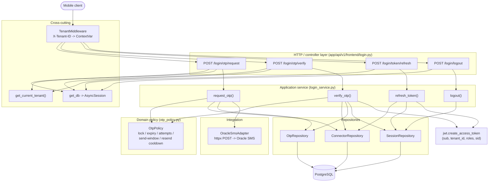
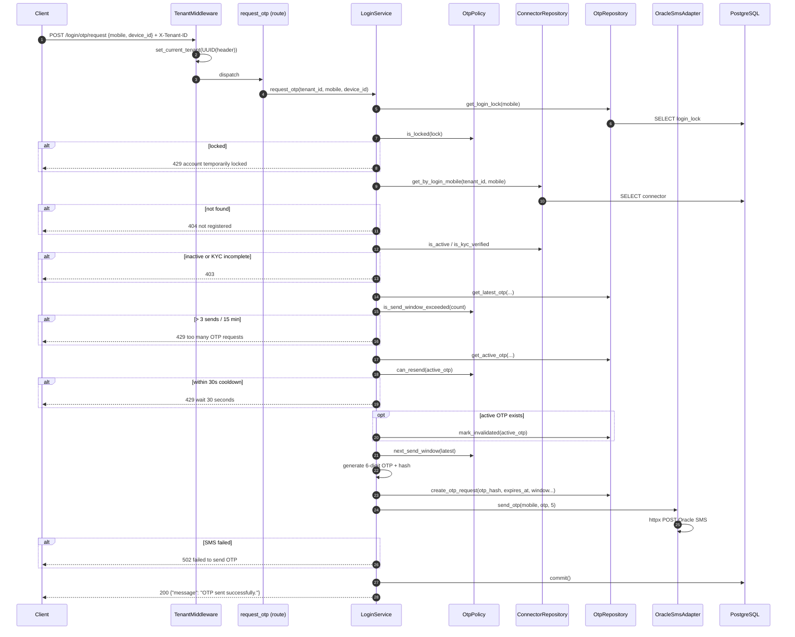
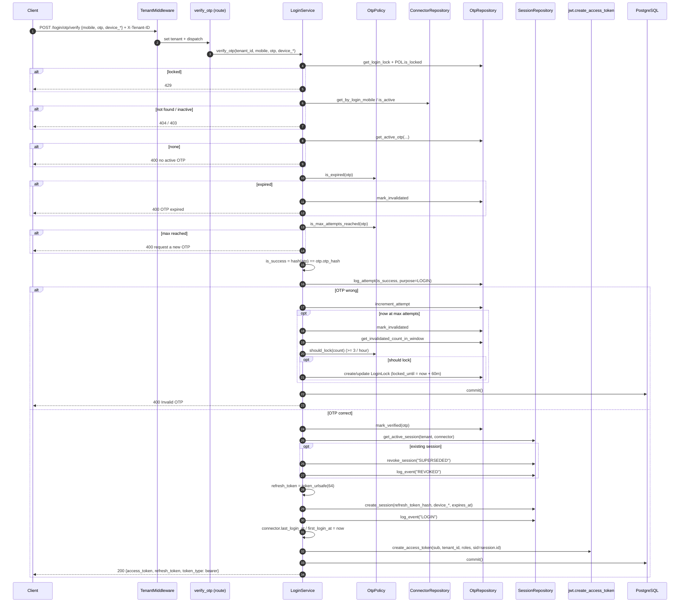
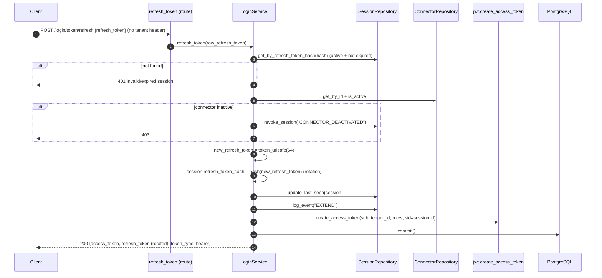
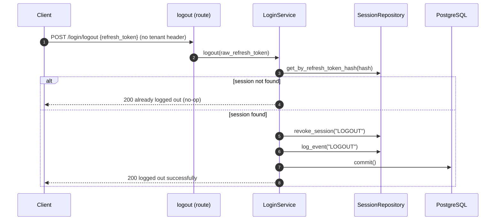

# Login & Authentication Flow

The Connector App uses **OTP-over-SMS** authentication (no passwords). A successful
OTP verification issues a short-lived JWT **access token** and a long-lived
**refresh token** bound to a single active device session per connector.

All login endpoints live under `/api/v1/frontend/login` and are **public**
(they mint tokens). Every other `/api/v1/frontend/*` route requires a valid
access token via the `get_current_connector` dependency.

Cross-cutting pieces:

- `TenantMiddleware` reads the `X-Tenant-ID` header into a `ContextVar` on every request.
- `get_db` yields an async SQLAlchemy session.
- `app/auth/jwt.py` mints/validates the access token; the token carries `sub`
  (connector id), `tenant_id`, `roles`, and `sid` (session id).

---

## Layered call graph



---

## Flow 1 — Request OTP



---

## Flow 2 — Verify OTP (the actual login)



---

## Flow 3 — Refresh access token (with refresh-token rotation)



---

## Flow 4 — Logout (idempotent)



---

## Protected request — using the issued access token

Applied as a router-level dependency to every non-login `/frontend` route
(profile, customers, leads, pipeline, payouts, marketplace, calendar).

```mermaid
sequenceDiagram
    autonumber
    participant C as Client
    participant DEP as get_current_connector
    participant JWT as jwt.decode_access_token
    participant CR as ConnectorRepository
    participant DB as PostgreSQL

    C->>DEP: <protected route> Authorization: Bearer <access_token>
    DEP->>JWT: decode_access_token(token)  (HS256; requires sub, tenant_id, sid)
    alt invalid / missing claims
        DEP-->>C: 401 invalid or expired token
    end
    DEP->>DB: SELECT session WHERE id = sid AND connector_id AND tenant_id AND is_active AND revoked_at IS NULL
    alt session not the token's active session
        DEP-->>C: 401 session expired or revoked
    end
    DEP->>DB: session.last_seen_at = now; commit()  (sliding window)
    DEP->>CR: get_by_id + is_active
    alt connector inactive
        DEP-->>C: 403
    end
    DEP-->>C: proceed with Connector
```

---

## Token & session rules (summary)

| Rule | Value / behavior | Source |
| --- | --- | --- |
| OTP length / expiry | 6 digits, 5 minutes | `OtpPolicy.OTP_EXPIRE_MINUTES` |
| Resend cooldown | 30 seconds | `OtpPolicy.RESEND_COOLDOWN_SECONDS` |
| Max verify attempts | 5 per OTP | `OtpPolicy.MAX_ATTEMPTS` |
| Send rate limit | 3 sends / 15 min (rolling window) | `OtpPolicy.MAX_SENDS_PER_WINDOW` |
| Soft lock trigger | 3 invalidated OTPs / hour | `OtpPolicy.MAX_INVALIDATIONS_PER_HOUR` |
| Lock duration | 60 minutes | `OtpPolicy.LOCK_DURATION_MINUTES` |
| Active sessions per connector | 1 (new login supersedes old) | `SessionRepository.get_active_session` |
| Access token claims | `sub`, `tenant_id`, `roles`, `sid` | `jwt.create_access_token` |
| Refresh token | rotated on every refresh; stored as SHA-256 hash | `login_service.refresh_token` |
| Logout | idempotent (unknown token still returns success) | `login_service.logout` |
